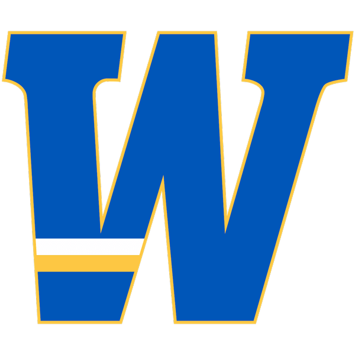
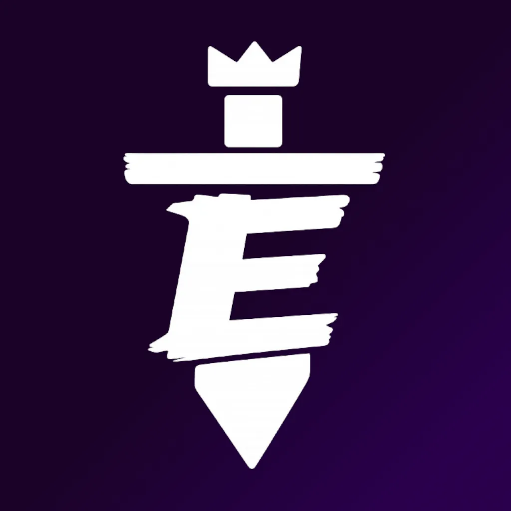

 

# Widener Esports Stream Control

A Windows app for running esports streams in OBS. It builds the OBS scenes for
every overlay (Starting Soon, Rosters, Scoreboard and the rest), fills them with
the match you set up, and keeps them up to date while you keep score.

The same app is built once per league, each with that league's colours, logos,
scene background, stinger transition, games and OBS scene names:

| App | For | Control panel | OBS scene collection |
| --- | --- | --- | --- |
| Widener Esports Stream Control | Widener Esports streams (NECC) | `http://localhost:4310/control` | Widener Stream, scenes `WU: …` |
| LotE Stream Control | League of the East broadcasts | `http://localhost:4320/control` | LotE Stream, scenes `LotE: …` |

Download the installers from the [latest release](https://github.com/bos-tn/widener-stream-control-app/releases/latest).
The two apps install side by side, keep separate settings, and can both be open
at once. Each checks for its own new versions and offers to install them.
Installing over an old version keeps your settings, teams and saved matches.

The app runs entirely on the streaming PC and can only be reached from that PC.
It needs internet access only for the LeagueOS import, league graphics, and
update checks.

The rest of this guide uses the Widener app's names. For League of the East,
read `LotE` for `WU` and port 4320 for 4310. LotE has no game highlight videos
or included music track yet, so those parts don't appear in it. It comes with
the league's member schools (names, short names, colours and logos) already in
its team library.

## How it works (v2.0.0)

**OBS decides what is on stream.** The app builds a scene collection in OBS
with one scene per overlay, each holding a browser source that always shows the
current match:

- **Starting Soon** and **Post-Match**: title, subtitle, countdown, and the game's highlight video (or your own)
- **Rosters**: the two teams' lineups
- **Be Right Back**
- **Scoreboard**: the in-game scoreboard, over a game capture the app adds for you. For Rocket League it reads the game itself
- **Rocket League Stats** (leagues that play Rocket League): each game's stats and the series overview
- One scene per **league graphic** you pick (bracket, match preview and others, pulled from LeagueOS)

You switch scenes in OBS, the way you would with any scene collection. Studio
Mode (turned on by the setup) lets you look at the next scene before clicking
Transition. The league's stinger plays on every switch. The app switches scenes
itself only where it helps: it cuts to the Rocket League Stats scene after each
game, and back to the Scoreboard when the next game loads.

The control panel is for setting up the match and keeping it right while you
are live: the score, the rosters, and each scene's text. Everything you change
shows on every scene at once. A text box goes out when you press **Enter** or
click away from it, so half-typed words never reach the stream; the box
flashes green when it has.

There is no Push Live, preview, or one-link browser source any more (they were
in v1). OBS Studio Mode is the preview.

## First-time setup

The first time v2 runs, a setup guide walks through this. Run it again any time
from Settings, Setup guide. You need OBS 30 or newer.

1. **Connect to OBS.** In OBS, open Tools, WebSocket Server Settings. Tick
   Enable WebSocket server, click Show Connect Info, and paste the password into
   the app. From then on the app connects by itself whenever it starts, and
   reconnects if OBS restarts.
2. **Build the scenes.** The app creates the **Widener Stream** scene collection
   (your other scene collections are not touched) and switches OBS to it. It adds
   a Game Capture under the scoreboard, set to capture any fullscreen
   application; in OBS you can point it at one window instead. If OBS can't make
   a Game Capture, the app says so and explains how to add a Window Capture
   yourself. Building again later updates the scenes instead of duplicating
   them, and leaves scenes you added yourself alone.
3. **Add the stinger.** OBS doesn't let apps create transitions, so add it once:
   with the Widener Stream collection open, find the Scene Transitions dock,
   click **+**, pick **Stinger**, name it exactly **Widener Stinger** (LotE:
   **LotE Stinger**), click OK, and click OK again on its settings. Then click
   **Set up the stinger** in the app. It copies the stinger video to the app's
   data folder (OBS can't read it from inside the app), points the transition at
   it with the right cut point and track matte, and makes it OBS's transition.
   The guide also lists those settings, so you can check them in OBS.
4. **Download the game videos** (Widener), so none starts downloading mid-stream.

The OBS password is stored only on the streaming PC. While OBS isn't connected,
a yellow bar across the top of the panel says so.

## Setting up a match

The **Match** page walks through four steps. The numbers at the top jump
between them, and turn green as each is done.

1. **Game.** Click the game. It sets the scoreboard style, series length and
   highlight video. "Another game" scores by hand with any game name.
2. **Teams.** Three ways, mixed as you like:
   - **Import a match link**: paste the LeagueOS match page link and click
     Import. It fills in both teams and their players, the start time, the series
     length and the league graphic links, and saves both teams to the library.
   - **Saved teams** (LotE: **LotE schools**): click a team to make it Team A,
     then one for Team B. Use the Team A / Team B switch, or click a slot at the
     top, to choose which one a click fills.
   - **Type them in**: names, short names, colours, logos and players. Drag a
     player's handle to reorder.

   The Starting Soon subtitle fills itself in as "Team A vs Team B" (on a
   school's own stream, "vs Opponent") unless you wrote something else there.
3. **Details.** The start time (at a time, or in a number of minutes), the
   series length and round, the Starting Soon subtitle, the next match, which
   league graphics get a scene, the background video, and music on or off.
4. **Scenes.** A checklist (OBS connected, game, teams, start time, stinger),
   then **Build or update scenes**. Build again after changing which league
   graphics get a scene. Save the match here to load it again later; saved
   matches load from the list at the top of the page.

## During the match

The **Live** page:

- **On air**: the scene OBS has on program, with a small picture of it (turn the
  picture off under Settings, Display on a slower PC).
- **Score**: a big Won button per team, plus and minus to correct, Swap sides, and
  Reset score (click twice). Smash crew battles add Lost a stock and Undo per team.
  Score changes are on stream at once.
- **Scenes**: every scene the app built, with the one on air marked in red. Open a
  scene to edit its own title, subtitle and badge; Post-Match also has its
  countdown length and layout. **Put on air** cuts OBS to that scene with the
  stinger.
- **Rosters**: fix a name, add a sub, or reorder players mid-match.

Post-Match counts down from its own length (2:00 by default), starting when it
goes on air, so it never touches the Starting Soon countdown.

## Rocket League

Picking Rocket League switches the scoreboard to its Rocket League style, which
reads live data from the game through Rocket League's official Stats API (the
same feed BARL uses since the EAC update; BakkesMod is not needed):

- a compact centre board: round and game number, team logos, this game's goals,
  and the match clock (gold in overtime, REPLAY during goal replays)
- the series score as pips under each team, counted automatically when a game ends
  (best of 7 by default; a LeagueOS import sets it from the match)
- each player's boost in the top corners
- a goal banner with the scorer and assist
- a boost meter for the player the camera is following, with their stats

The stats have their own scene, **WU: Rocket League Stats**: every player's
score, goals, assists, shots, saves and demos for a game with its MVP, or the
series overview (each game's score and map, series totals and a series MVP).
Three seconds after a game ends, the app cuts OBS to it with that game's stats;
once the series is won it moves on to the series overview 15 seconds later. When
the next game loads mid-series, the app cuts back to the Scoreboard (only if it
was the app that cut to the stats). Untick "Cut to the stats after each game"
to do it all by hand.

The Score card's **Rocket League Stats scene** buttons put up any game's stats or
the series overview, to fill time between games; **Back to the game** cuts to
the Scoreboard. Before game 1, the Stats scene shows the two rosters under "Up
next". Reset score starts a new series record.

One-time setup on the streaming PC:

1. The Score card shows the game connection. If it says Rocket League is not set
   up to share match data, click **Connect to Rocket League**. This sets
   `PacketSendRate=30` in
   `Documents\My Games\Rocket League\TAGame\Config\TAStatsAPI.ini`.
2. Fully close and restart Rocket League. It only reads that file at launch.
3. Spectate the match. Hide the game's own HUD in spectator mode so its
   scoreboard and boost meter don't sit under ours.

Blue is always the left side. If team A is playing orange, click Swap sides;
the panel offers this itself when the roster gamertags match the players on
blue. Auto-counting stops once a team has clinched the series, and can be
turned off under Scoreboard settings for scrims.

## Game highlight videos

Every Widener game except Call of Duty has a highlight video on the team Google
Drive. Starting Soon and Post-Match play the selected game's video, and picking
a different game swaps it. A background video picked in Match, Details replaces
it.

The videos are too big to ship with the installer (6.5 GB in all), so each PC
downloads them from Drive into the app's own data folder the first time a game
is picked. To avoid a download starting mid-stream, use the setup guide or
Settings, Game highlight videos, **Download all** before your first stream on a
new PC. A download that is cut off picks up where it left off. The Drive files
must stay shared as "Anyone with the link".

## Team library and saved matches

Every LeagueOS import saves both teams to the library, and each team has a Save
to library button. The LotE app starts with all of the league's member schools
in it. Settings, Team library lists them all, with Edit (name, short name,
colour, logo, players) and Delete (undoable for a few seconds). A deleted league
school stays deleted. When an imported team belongs to a league school, the
league's own logo is used instead of the LeagueOS one.

A saved match keeps the teams, text, start time, scoreboard settings and league
graphic links, never the score.

## Background music

Music plays whenever no gameplay is on air: Starting Soon, Be Right Back,
Post-Match, Rosters, league graphics, Rocket League Stats, and the Rocket League
menus between games. It fades out when gameplay is on air. Widener's included
track downloads from the team Google Drive (36 MB) the first time it's needed;
Settings, Background music can pick any audio file instead, change the volume,
or turn it off. OBS plays it through one media source, **WU: Music**, in every
scene, so it carries on through scene changes.

## Keyboard shortcuts

| Keys | Action |
| --- | --- |
| Enter (in a text box) | Put that text on stream |
| 1 / 2 | Team A / Team B lost a stock |
| Shift+1 / Shift+2 | Undo a stock for Team A / Team B |
| 3 / 4 | Team A / Team B won a game, map, or set |
| Ctrl+plus / Ctrl+minus / Ctrl+0 | Bigger, smaller, or normal panel text |
| ? | Show the shortcut list |

The scoring keys work on the Live page while you are not typing in a box. In an
OBS dock, click the dock first so it has keyboard focus.

## Stream Deck and remote control

A Stream Deck (with a plugin that sends web requests), Bitfocus Companion, a
macro pad, or a script on the streaming PC can keep score and cut scenes. Each
button sends a POST request to an address such as
`http://localhost:4310/api/remote/score/a/win`. Settings, Stream Deck and remote
control lists every address with a Copy button: cut to each scene, show the
last game's stats or the series overview, and the scoring actions. Only programs
on the PC can use these: requests sent from a web page are refused. v1 buttons
that picked an overlay (`/api/remote/overlay/<name>`) now cut to its scene;
v1's Push Live and Discard buttons no longer exist.

## The control panel in OBS

In OBS, go to Docks, Custom Browser Docks, and add the address under Settings,
OBS (`http://localhost:4310/control`). Add `?page=live` to the address
(`http://localhost:4310/control?page=live`) for a dock that opens on the Live
page. The app window and the dock can be open at the same time; they share the
same match, score, library and options.

## Troubleshooting

| Problem | Fix |
| --- | --- |
| The yellow bar says OBS is not connected | Open OBS, and check Tools, WebSocket Server Settings is enabled. Click Connect to OBS in the bar. |
| A scene says "Not in OBS yet" | Build the scenes again (Match, Scenes, or Settings, OBS). Check OBS has the Widener Stream scene collection open. |
| Set up the stinger says there is no such transition | The name must match exactly (Widener Stinger, LotE Stinger), and it must be added with the app's scene collection open: each collection has its own transitions. |
| OBS shows an old version of a scene | Right-click its browser source and click Refresh. |
| The Scoreboard scene shows no game | Point the WU-game-capture source at the game's window in OBS, or put Rocket League in fullscreen. |
| Text I typed isn't on stream | Press Enter or click away from the box. It flashes green once it's sent. |
| "Port 4310 is already in use" | Another copy of the app is still running. Close it first. |
| League graphic Import fails | LeagueOS may have changed their site. Pick or type the teams instead, or load a saved match. |
| A league graphic scene is empty | Import the match: its link comes from the import. Without one the scene shows the background only. |
| Rocket League stays on "Waiting for Rocket League" | Click Connect to Rocket League in the Score card, then fully restart the game. |
| Rocket League boost shows a dash | The game only sends boost while spectating. Spectate the match from the streaming PC. |
| Another computer can't open the control panel | That is intended: the app only accepts connections from the streaming PC. |

## For developers

Requires [Node.js](https://nodejs.org/) 18 or newer.

```bash
cd app
npm install
npm start             # run the Widener app
npm run start:lote    # run the League of the East app
npm run server        # run only the server (Widener, port 4310)
npm run server:lote   # run only the server (LotE, port 4320)
npm run dist          # build every league's installer
npm run dist:lote     # build one league's installer
npm run icons         # rebuild app icons from profiles/<id>/icon-source.png
npm run stinger -- lote   # render a league's drawn stinger video (needs ffmpeg)
```

### League profiles

Everything that belongs to one league lives in `app/profiles/<id>/`, and each
installer is built with exactly one profile inside:

| File | What it holds |
| --- | --- |
| `profile.json` | Name, short name, app name, port, OBS scene prefix, league name and import hint, home team, colours (overlay and control panel), asset file names, stinger (video file, cut point in ms, track matte or not), music track, defaults, and the installer's app id, package name (its data folder), file name and update channel |
| `games.json` | The game list and each game's scoreboard preset and highlight video |
| `teams.json` | Optional: the league's member schools (id, name, short name, colours, logo), preloaded into the team library |
| `assets/` | Logo, control panel logo, mascot (Be Right Back), watermark, stinger video, `teams/` logos |
| `theme.css` | Optional overlay styles loaded after the base ones, such as LotE's Mark Shine background |
| `icon-source.png`, `icons/` | The app icon source and the generated icons |

The stinger is an OBS Stinger transition. Widener's video carries a track matte
beside the picture; LotE's is a VP9 WebM with real transparency, drawn by
`build/make-stinger.js` from the league colours and mark (`npm run stinger --
<id>`). A league with its own stinger video just drops it in `assets/` and
measures the cut point.

To add a league: copy `profiles/lote` to `profiles/<id>`, change `profile.json`
(a new `port`, `obs.prefix`, `build.appId`, `build.packageName`,
`build.artifactName` and `build.channel`), replace the art, `games.json` and
`teams.json`, run `npm run icons -- <id>`, and `npm run dist -- <id>`.

### Building and releasing

Bump `version` in `app/package.json` before building; every league's app shares
it. Each installer, its `.blockmap` and its update file are written to
`app/dist/<id>/`, with an unpacked copy in `app/dist/<id>/win-unpacked/`. Test
the unpacked builds before releasing, since the packaged app can behave
differently from dev mode. Any new top-level `.js` file in `app/` must be added
to `build.files` in `app/package.json` or the packaged app will crash on launch.

To release, create one GitHub release tagged `v<version>` and attach, for every
league, the installer `.exe`, its `.blockmap`, and its update file: `latest.yml`
for Widener, `lote.yml` for League of the East.

### How the pieces fit

There is one match state on the server (`state.json` in the app's data folder),
shown on every scene. Each OBS scene's browser source loads
`/overlay?view=<view>` (league graphics add `&necc=<type>`), which pins the page
to that view. The server follows OBS's program scene (`CurrentProgramSceneChanged`)
to know what is on air: for music, the Post-Match countdown, the Rocket League
stats cuts and the panel's On air marker. Panels send edits as partial updates
(`{type:'update'}`); score counters go separately (`{type:'score'}`), so a
second panel can never send a stale score.

Panel options every window must agree on (league graphic scenes, game capture,
Studio Mode, setup guide done) are kept in `settings.json` under `panel` and
served at `/api/prefs`. The OBS routes are `/api/obs/*`; the Stream Deck routes
are `POST /api/remote/*`, and `GET /api/remote` lists them.

Repo layout:

```
app/
  main.js            Electron entry point and update checks
  server.js          local server, match state, library, WebSocket messages
  profile.js         league profiles: loading, /brand.js and /brand.css
  necc.js            LeagueOS import
  obs.js             OBS: scene collection, scenes, stinger, music, program scene
  rlstats.js         Rocket League Stats API client (live game data)
  build/dist.js      builds one installer per league profile
  build/make-icon.js app icons from each profile's icon source
  build/make-stinger.js  a league's drawn stinger video (transparent WebM)
  dev/mock-rlstats.js  fake Rocket League feed for testing without the game
  profiles/
    widener/         Widener Esports: profile.json, games.json, assets, icons
    lote/            League of the East: the same, plus teams.json and theme.css
  templates/
    overlay.html     the overlay page (all views, every league)
  public/control/    control panel
  public/overlay-assets/  fonts shared by every league
archive/             old per-game overlay files, kept for reference
PROJECT_NOTES.md     detailed design notes and history
```

The LeagueOS import uses LeagueOS's internal API, which is not official or
documented. If it breaks, everything can still be entered by hand.

This is an internal Widener University Esports project and is not licensed for
outside use.
