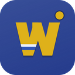

# Widener Esports Stream Control

A Windows app for running the Widener Esports stream overlays. It replaces the
old folder of per-game overlay HTML files with one overlay that you edit from a
control panel.

Download the installer from the [latest release](https://github.com/bos-tn/widener-stream-control-app/releases/latest).
From v0.9.0 on, the app checks for new versions by itself and offers to install
them. Installing over an old version keeps your settings.

The app runs entirely on the streaming PC and can only be reached from that PC.
It needs internet access only for the NECC import, NECC graphics, and update
checks.

## What it does

The app has one overlay page that OBS loads from `http://localhost:4310/overlay`.
The control panel decides what that page shows. The available overlays are:

- Starting Soon and Post-Match, with a title, subtitle, countdown, and the selected game's montage (or your own clip)
- Rosters, a two-team lineup
- Be Right Back
- Scoreboard, an in-game scoreboard for any game (series score, with a stock counter for Smash).
  For Rocket League it reads the game itself: goals, clock, boost, and player stats
- NECC graphics (bracket, match preview, and others) pulled from LeagueOS

Edits made in the control panel show up in the preview first. The stream does
not change until you click Push Live. Discard changes throws away your edits and
resets the preview to whatever is on stream. The Push Live button turns gold
when the preview has changes that have not been pushed.

The control panel works like OBS Studio Mode: the **Preview** monitor (green
border) shows your draft, the **Live on stream** monitor (red border) shows what
viewers see, and Push Live sits between them. Below the monitors are three
pages:

- **Prep**: the game, the match (NECC import and saved matches), the two teams,
  and the team library.
- **Live**: the overlay strip, the scoreboard, and the fields of the overlay in
  the preview. Only that overlay's fields are shown.
- **Settings**: OBS, background music, game videos, NECC graphics, socials,
  display, Stream Deck addresses, and the setup guide.

## Setting up OBS

The first time the app starts on a new PC, a setup guide walks through this. It
can be run again from Settings.

The recommended way is to let the app manage OBS scenes (see "Letting the app
switch OBS scenes" below). The simplest way is one browser source:

1. Install and open the app.
2. On the Settings page, copy the browser source address.
3. In OBS, add a Browser Source to each scene that needs the overlay. Paste the
   address and set the size to 1920 x 1080.

The address is the same for every game and every overlay, so this only needs to
be done once.

Do not use the preview's URL (the one ending in `?preview=1`) in OBS. That page
shows unpushed edits. If a red "Preview, not live" badge appears on stream, the
wrong URL is in OBS.

## Running a stream

1. On **Prep**, pick the game. This fills in the game name and loads that
   game's scoreboard settings and highlight video.
2. Fill in the teams: paste a NECC match link under Match and click Import,
   pick a saved team in the team library (Team A or Team B), or type them in
   under Teams. A filled-in team folds to one line; click Edit to change it.
   Drag the handle on the left of a player to reorder them.
3. On **Live**, click an overlay in the strip. The card with the green PREVIEW
   tag is in the preview; the one tagged LIVE is on stream. Picking an overlay
   fills in a default title and countdown for it. Tick "Push live as soon as I
   pick an overlay" if you want overlay switches to skip the preview.
4. Edit the overlay's fields below the strip: title, subtitle, badge text,
   countdown (minutes:seconds, such as 10:00), background video, logo, and next
   match. The title, subtitle, and badge are saved separately for each overlay.
   Editing other fields does not restart a running countdown; use Restart
   countdown for that.
5. Click Push Live (Ctrl+Enter). If "Play transition" is checked, the Widener
   curtain wipe plays on stream and the change happens behind it.

Undo and Redo, under Push Live, step back and forward through your recent edits.
Press **?** for the list of keyboard shortcuts, and hover over any ⓘ for a short
explanation of a setting.

Settings, Display changes the panel's text size (Ctrl+plus and Ctrl+minus also
work) and can turn off the live monitor on a slower PC. These apply to the one
window, so an OBS dock can use its own size.

## Game montages

Every game except Call of Duty has a highlight montage on the team Google
Drive (the panel calls them highlight videos). Starting Soon, Post-Match and Be
Right Back play the selected game's montage in the video panel, and picking a
different game swaps it. A background video picked on the Live page replaces
the montage.

The montages are too big to ship with the installer (6.5 GB in all), so each
PC downloads them from Drive into the app's own data folder the first time a
game is picked. The status line under the Game picker shows the progress. To
avoid a download starting mid-stream, use the setup guide or Settings, Game
highlight videos, **Download all** before your first stream on a new PC. A
download that is cut off picks up where it left off.

The Drive files must stay shared as "Anyone with the link". If they are made
private, downloads fail with a message saying so. Montages already on a PC keep
working.

## Saved matches and the team library

On Prep, under Match, "Save this setup as" stores the teams, rosters, text,
countdown, scoreboard settings, and NECC links for a match. Load brings them
back later. Loading does not change which overlay is up or the live score.
Delete removes a saved match at once, with an Undo button for a few seconds.

Each team has a Save to library button, and every NECC import saves both teams
automatically. Saved teams appear as cards in the Team library on Prep, with
buttons to use one as Team A or Team B, edit it, or delete it (also undoable),
and a search box. They are also in the "Load a saved team" list above each
team. Team logos from NECC are downloaded once and stored on the PC.

## Scoreboard

Click the Scoreboard overlay. Its card also stays on the Live page while the
scoreboard is on stream, so you can keep score while preparing the next
overlay.

The scoreboard has a transparent background, so in OBS the browser source must
be placed above the game capture. It comes in two layouts: a full bar across
the top center, or a smaller box in one of the four corners for games whose own
HUD uses the top of the screen. Picking a game sets a starting position,
best-of, and wording (Game, Map, or Set); check these over real gameplay and
change them under Scoreboard settings if needed. Team colors come from the
color picker next to each team name on Prep, and color each team's column.

- Click the big "Won game" (or map, or set) button on the winning team to add a
  point. The minus and plus buttons correct the score.
- Swap sides moves each team to the other side.
- Reset match sets everything back to zero. It needs a second click to confirm.

For Smash crew battles, turn on the stock counter (the Smash preset does this).
The default is 4 players per team with 3 stocks each. Players are used in roster
order, and the first player with stocks left is shown as on stage. Click "Lost
a stock" when a player loses one; Undo reverses a misclick. "Won set" refills
both teams' stocks.

Score changes go to the stream immediately, without Push Live or the curtain
wipe. Uncheck "Scores go live instantly" to preview them first instead. Each
scoring button shows its keyboard key.

### Rocket League

Picking Rocket League as the game switches the scoreboard to its Rocket League
style, which reads live data from the game through Rocket League's official
Stats API (the same feed BARL uses since the EAC update; BakkesMod is not
needed). It shows:

- a compact centre board: round and game number, team logos, this game's goals, and
  the match clock (gold in overtime, REPLAY during goal replays)
- the series score as pips under each team, counted automatically when a game ends
  (best of 7 by default; a NECC import sets it from the match)
- each player's boost in the top corners
- a goal banner with the scorer and assist
- a boost meter in the bottom right for the player the camera is following, with their stats
- a full-screen stats screen after each game (every player's score, goals, assists,
  shots, saves and demos, with the game's MVP), and a series overview once the
  series is won (each game's score and map, and series totals with a series MVP)

The board switches by itself: to the game's stats 3 seconds after a game ends
(under the Widener curtain stinger),
to the series overview 15 seconds after the deciding game, and back to the live
board when the next game loads (not once the series is won). The **On the board**
buttons in the Scoreboard card switch by hand, including to an earlier game's
stats. Reset match starts a new series record.

One-time setup on the streaming PC:

1. With the Scoreboard overlay selected, the Scoreboard card shows the game
   connection. If it says Rocket League is not set up to share match data, click
   **Connect to Rocket League**. This turns on the game's Stats API by setting
   `PacketSendRate=30` in
   `Documents\My Games\Rocket League\TAGame\Config\TAStatsAPI.ini`.
2. Fully close and restart Rocket League. It only reads that file at launch.
3. Spectate the match. Hide the game's own HUD in spectator mode so its
   scoreboard and boost meter don't sit under ours.

Blue is always the left side. If team A is playing orange, click Swap sides;
the panel offers this itself when the roster gamertags match the players on
blue. Auto-counting stops once a team has clinched the series, and can be
turned off under Scoreboard settings for scrims. The plus and minus buttons
still correct the series score. The preview shows sample data when the game
isn't in a match, so the layout can be checked any time; the stream never does.

## Keyboard shortcuts

| Keys | Action |
| --- | --- |
| Ctrl+Enter | Push Live |
| Ctrl+1 to Ctrl+9 | Pick an overlay by its place in the strip |
| Ctrl+Z / Ctrl+Y | Undo / redo an edit (outside text boxes) |
| 1 / 2 | Team A / Team B lost a stock |
| Shift+1 / Shift+2 | Undo a stock for Team A / Team B |
| 3 / 4 | Team A / Team B won a game, map, or set |
| Ctrl+plus / Ctrl+minus / Ctrl+0 | Bigger, smaller, or normal panel text |
| ? | Show the shortcut list |

The scoreboard keys work while the Scoreboard card is on screen and you are not
typing in a box. In an OBS dock, click the dock first so it has keyboard focus.

## Stream Deck and remote control

A Stream Deck (with a plugin that sends web requests), Bitfocus Companion, a
macro pad, or a script on the streaming PC can run the show. Each button sends a
POST request to an address such as `http://localhost:4310/api/remote/push`.
Settings, Stream Deck and remote control lists every address with a Copy button:
Push Live, Discard changes, each overlay, each enabled NECC graphic, and the
scoring actions (won a game, plus or minus a point, lost or undo a stock, swap
sides).

Picking an overlay this way puts it in the preview (or straight on stream with
"Push live as soon as I pick an overlay"), and every open panel follows. Score
changes always go live at once. Only programs on the PC can use these: requests
sent from a web page are refused.

## Background music

Music plays whenever there is no gameplay on screen: Starting Soon, Be Right
Back, Post-Match, Rosters, NECC, and the Rocket League stats screens and menus
between games. It fades out when gameplay is on screen. The included track
isn't in the installer: like the game montages, it downloads from the team
Google Drive (36 MB) the first time it's needed. Settings, Background music can
pick any audio file on the PC instead, change the volume, or turn music off.

OBS plays the music, so it needs OBS connected (see below). Build or update
scenes adds one media source, **WU: Music**, to every WU scene. Because it is
the same source in every scene, it carries on through scene changes instead of
starting over, and it loops.

## Letting the app switch OBS scenes, and the OBS dock

Control panel as an OBS dock (optional): in OBS, go to Docks, then Custom
Browser Docks. Add a dock using the address under Settings, OBS, "Run this
panel inside OBS" (`http://localhost:4310/control`). The panel then appears
inside the OBS window, with the monitors stacked on top. The app window and the
dock can be open at the same time; they share the same score, library, draft,
and options.

Letting the app switch OBS scenes (recommended; also called scene-sync): the
app switches OBS scenes on each Push Live, using OBS's own transition. The setup
guide does these steps for you.

1. In OBS 28 or newer, go to Tools, then WebSocket Server Settings. Enable the
   server and copy the password.
2. Under Settings, OBS, enter the password (and the address and port, if OBS is
   not on this PC's defaults), then click Connect.
3. Click "Build or update scenes in OBS". This creates one scene per overlay
   (Starting Soon, Post-Match, Rosters, Be Right Back, Scoreboard, NECC).
   Running it again updates the existing scenes instead of making duplicates.
4. Check "Let the app switch OBS scenes on Push Live" and pick a transition.

After one successful Connect, the app connects to OBS by itself whenever it
starts, and reconnects if OBS is closed or restarted. An OBS status light
appears in the top bar. Switching scenes by hand in OBS moves the LIVE marker
on the overlay strip to match. While the app is switching scenes, its own
curtain transition is turned off so the two transitions do not play at once.
For the
Scoreboard scene, add your game capture below the browser source yourself.

The OBS password is stored only on the streaming PC. If OBS cannot be reached,
Push Live still works normally.

## Troubleshooting

| Problem | Fix |
| --- | --- |
| OBS shows an old version of the overlay | Right-click the browser source and click Refresh, or remove and re-add it. |
| The stream changes before Push Live is clicked | The OBS source is using the `?preview=1` URL, or "Push live as soon as I pick an overlay" is ticked. |
| "Port 4310 is already in use" | Another copy of the app is still running. Close it first. |
| No curtain wipe on push | Check the "Play transition" box under Push Live. It is turned off automatically while the app switches OBS scenes. It also needs hardware acceleration enabled in OBS. |
| OBS light says "OBS offline" or "reconnecting" | OBS is closed, or its WebSocket server is off. The app keeps trying on its own once OBS is back. |
| NECC Import fails | LeagueOS may have changed their site. Enter the teams by hand or load a saved match. |
| A NECC card says "Needs a match import" | Import the match on Prep first. Clicking the card takes you there. |
| The panel is slow on the streaming PC | Turn off the live monitor under Settings, Display. |
| A NECC graphic shows only a spinner | LeagueOS is slow or unreachable. The preview says so after about 12 seconds. |
| Scoreboard is not visible over the game | The browser source is below the game capture in the OBS source list. Move it above. |
| Rocket League stays on "Waiting for Rocket League" | Click Connect to Rocket League in the Scoreboard card, then fully restart the game. The board fills in once a match is loaded. |
| Rocket League boost shows a dash | The game only sends boost while spectating (or for your own team). Spectate the match from the streaming PC. |
| Another computer can't open the control panel | That is intended: the app only accepts connections from the streaming PC. |

## For developers

Requires [Node.js](https://nodejs.org/) 18 or newer.

```bash
cd app
npm install
npm start        # run the full app
npm run server   # run only the server at http://localhost:4310
npm run dist     # build the installer
```

Bump `version` in `app/package.json` before building. The installer and
`latest.yml` are written to `app/dist/`, along with an unpacked copy in
`app/dist/win-unpacked/`. Test the unpacked build before releasing, since the
packaged app can behave differently from dev mode. Any new top-level `.js` file
in `app/` must be added to `build.files` in `app/package.json` or the packaged
app will crash on launch.

To release, create a GitHub release tagged `v<version>` and attach the
installer `.exe`, its `.blockmap`, and `latest.yml`. Installed copies of the app
read `latest.yml` from the latest release to find updates, so a release without
it will not be offered to anyone.

The server holds two copies of the overlay state: `draft`, which the control
panel edits and the preview shows, and `live`, which OBS shows. Push Live copies
`draft` to `live`. The scoreboard's score and stock counters are the one
exception and are written to both at once.

Panel options that every window must agree on (transition on push, push on
pick, instant scores, NECC buttons and links, setup guide done) are kept in
`settings.json` under `panel` and served at `/api/prefs`. The Stream Deck
routes are `POST /api/remote/*` in `server.js`; `GET /api/remote` lists them.

Repo layout:

```
app/
  main.js            Electron entry point and update checks
  server.js          local server, overlay state, library, WebSocket messages
  necc.js            NECC / LeagueOS import
  obs.js             optional OBS scene-sync
  rlstats.js         Rocket League Stats API client (live game data)
  dev/mock-rlstats.js  fake Rocket League feed for testing without the game
  templates/
    overlay.html     the overlay page (all overlays)
    games.json       game list and per-game scoreboard settings
  public/control/    control panel
  public/overlay-assets/  stinger video, images, fonts
archive/             old per-game overlay files, kept for reference
PROJECT_NOTES.md     detailed design notes and history
```

The NECC import uses LeagueOS's internal API, which is not official or
documented. If it breaks, everything can still be entered by hand.

This is an internal Widener University Esports project and is not licensed for
outside use.
